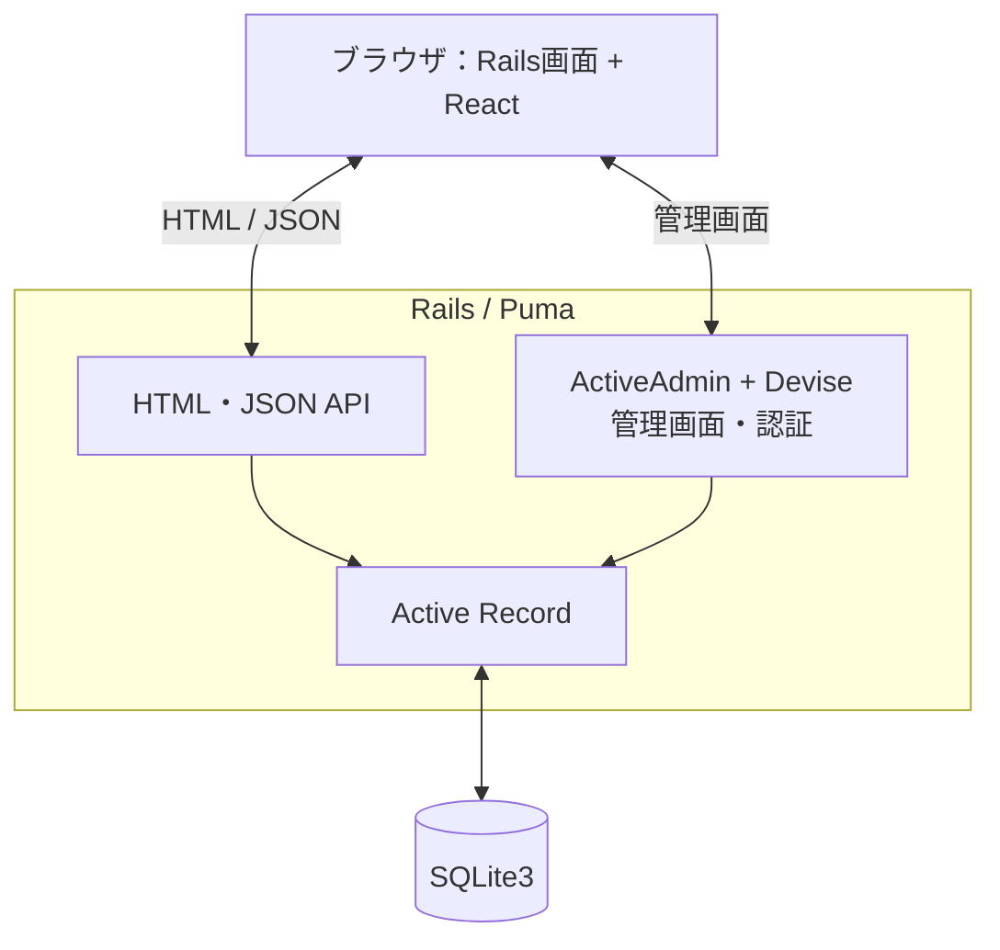

# Reception

施設の座席・部屋の利用受付を管理する、Rails + React のWebアプリです。

## 基本機能

- **利用状況の一覧**：ホール、集中ブース、会議室などの空き・利用中の状態を表示。
- **受付・返却**：会員番号や電話番号で利用者を検索し、貸し出し開始・返却と経過時間を管理。
- **管理画面**：利用者、部屋に対応するタグ、利用履歴、管理者を ActiveAdmin で管理。
- **メッセージ**：引き継ぎなどのメッセージを投稿・一覧表示。

## アーキテクチャ

Rails がHTML・JSON API・管理画面を提供し、受付画面に組み込んだ React が `/api/v1` のAPIを呼び出します。React 専用の別サーバーは不要です。



| 構成 | 技術・主な配置場所 |
| --- | --- |
| バックエンド | Ruby 3.2.5 / Rails 7.2.2、`app/controllers`・`app/models` |
| 受付画面 | React 18、`app/javascript/components` |
| JSビルド | Shakapacker 8 / Webpack、Node.js 22 / npm 10.5.2 |
| 管理画面 | ActiveAdmin / Devise、`app/admin` |
| データ | SQLite3、スキーマは `db/schema.rb` |
| テスト | Rails標準テスト、`test/` |

主なデータは利用者（`Registrant`）、タグ（`Tag`）、両者を結ぶ利用記録（`Occupy`）です。

## 開発環境のセットアップ

**必要なのは Git と Docker Desktop（Linuxコンテナ）です。Ruby・Node.js・mise のホストへの導入は不要です。** Docker Desktop を起動しておいてください。初回は依存パッケージのダウンロードに数分かかります。

以下は **Windows PowerShell** 用です。リポジトリをクローンし、`Gemfile` のあるプロジェクト直下へ移動して実行します。

### 初回のみ

```powershell
cd C:\Users\kyoma\Documents\dev\reception # 自分のクローン先に変更

docker version
if (-not (Test-Path config/database.yml)) {
  Copy-Item config/database.yml.example config/database.yml
}
docker build -t reception-dev -f Dockerfile.dev .
```

続けて、依存導入・DB初期化・JSビルド・サーバー起動を実行します。各コマンドが成功してから次に進んでください。既に `reception-dev` コンテナを作成済みの場合は、この `docker run` を実行せず「次回起動・停止」を使います。

```powershell
docker run -d --name reception-dev `
  -p 127.0.0.1:3000:3000 `
  --mount "type=bind,source=$($PWD.Path),target=/app" `
  --mount type=volume,source=reception-bundle,target=/usr/local/bundle `
  --mount type=volume,source=reception-node-modules,target=/app/node_modules `
  reception-dev bash -c 'bundle _2.5.16_ install && npm ci && bundle exec ruby bin/rails db:prepare && bundle exec ruby bin/shakapacker && exec bundle exec ruby bin/rails server -b 0.0.0.0 -p 3000'

docker logs --tail 50 -f reception-dev
```

ログに `Listening on http://0.0.0.0:3000` が表示されたら起動完了です。ログ確認は `Ctrl+C` で終了でき、サーバーは動き続けます。

- [受付画面](http://localhost:3000)
- [管理画面](http://localhost:3000/admin)：初期ログインは **`admin@example.com` / `password`**（開発専用）
- [稼働確認](http://localhost:3000/up)

初期データは管理者のみです。受付操作には管理画面で利用者とタグを登録してください。受付画面は6桁の番号を使用します（例：会員番号 `000001`、部屋101のタグ番号 `000101`）。表示する部屋番号は `app/javascript/components/App.js` に定義されています。

### 次回起動・停止

PowerShell で必要な操作だけ実行します。今回作成済みのコンテナも同じコマンドで操作できます。

```powershell
docker start reception-dev       # 起動
docker stop reception-dev        # 停止
docker logs --tail 50 -f reception-dev # ログ確認
```

起動時には依存導入・DB準備・ビルドが再実行されます。DBはホストの `storage/`、gemとJS依存はDocker volumeに残ります。今回作成済みのコンテナは `tmp/start-development.sh` を使用しているため、そのファイルを残してください。上記の新規セットアップ手順はこの補助ファイルに依存しません。

## テスト

起動中のコンテナに対して、PowerShell で実行します。

```powershell
docker exec -e RAILS_ENV=test reception-dev bundle exec ruby bin/rails test
```

14テスト・40アサーションの成功を確認済みです。別の空DBから初期化した場合も成功しています。システムテスト用のブラウザ・WebDriverは開発イメージに含まれません。

## 補足

- `docker` が見つからない場合は Docker Desktop のCLIのPATHを確認し、PowerShellを開き直してください。
- `Dockerfile.dev` は開発用です。既存の `Dockerfile` は本番向けの別設定です。
- `bin/rails` の先頭行が `ruby.exe` を指定しているため、Linuxでは上記のように `bundle exec ruby bin/rails` で実行します。
- 新規クローンでも同じ手順で設定できます。`config/database.yml`、DB、依存、秘密鍵はGit管理外です。通常の開発起動に `master.key` は不要です。
- Ruby 3.2はサポート終了済みです。2026-09-05の依存導入ではnpmの監査が38件の脆弱性を報告しています。本番運用前の更新・確認は別途必要です。
